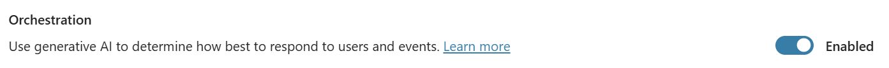

# Microsoft Copilot Studio ❤️ MCP

Welcome to the **Microsoft Copilot Studio ❤️ MCP** lab. In this lab, you will learn how to deploy an MCP Server, and how to add it to Microsoft Copilot Studio.

## What is MCP?

[Model Context Protocol (MCP)](https://modelcontextprotocol.io/introduction) is an open protocol that standardizes how applications provide context to LLMs, defined by [Anthropic](https://www.anthropic.com/). MCP provides a standardized way to connect AI models to different data sources and tools. MCP allows makers to seamlessly integrate existing knowledge servers and APIs directly into Copilot Studio.

Currently, Copilot Studio only supports Tools. To learn more about current capabilities, see [aka.ms/mcsmcp](https://aka.ms/mcsmcp). There are some known issues & planned improvements. These are listed [here](#known-issues-and-planned-improvements).

## MCP vs Connectors

When do you use MCP? And when do you use connectors? Will MCP replace connectors?

MCP servers are made available to Copilot Studio using connector infrastructure, so these questions are not really applicable. The fact that MCP servers use the connector infrastructure means they can employ enterprise security and governance controls such as [Virtual Network](https://learn.microsoft.com/power-platform/admin/vnet-support-overview) integration, [Data Loss Prevention](https://learn.microsoft.com/power-platform/admin/wp-data-loss-prevention) controls, [multiple authentication methods](https://learn.microsoft.com/connectors/custom-connectors/#2-secure-your-api)—all of which are available in this release—while supporting real-time data access for AI-powered agents.

So, MCP and connectors are really **better together**.

## Prerequisites

- Azure Subscription (with payment method added)
- Have a GitHub account and be logged in
- Copilot Studio trial or developer account
- Power Platform environment provisioned

## Lab

To be able to deploy this MCP Server and use it in Microsoft Copilot Studio, you need to go through the following actions:

- [Create a new GitHub repository based on the template](#create-a-new-github-repository-based-on-the-template)
- [Deploy the Azure Web App](#deploy-the-azure-web-app)
- [Create the Power Platform Connector](#create-the-power-platform-connector)
- [Add the MCP Server as an action in Microsoft Copilot Studio](#add-the-mcp-server-as-an-action-in-microsoft-copilot-studio)

### Create a new GitHub repository based on the template

1. Select `Use this template`
1. Select `Create a new repository

    

1. Select the right `Owner` 
1. Give it a `Repository name`
1. Optionally you can give it a `Description`
1. Select `Private`
1. Select `Create repository`

    This will take a little while. After it's done, you will be directed to the newly created repository.

> [!WARNING]  
> After completing the steps in this lab, you will have an MCP Server running on Azure that is publicly available. Ideally, you don't want that. Make sure to delete the Azure Web App after finishing the lab.

### Deploy the Azure Web App

1. Go to `portal.azure.com`

    

1. Hover over the `Resource groups` tab and select `Create`

    

1. Click the `Subscription` dropdown and select your subscription from the list

    

1. Click in the `Resource group` name text box and type a resource group name such as "jokesgrp"

    

1. Select the `Region` dropdown choose the region closest to you

    

1. Click `Review + create`

    

1. Click `Create`

    

1. Select `Go to resource group`

    

1. Select `Create`

    

1. Click into the `search box`

    

1. Type `web app`

1. Select the `Create button` in the Web App search result

    

1. Select `Web App`

    

1. Select the `Name` text input and put in a name for the web app, such as "wegotjokes"

    

1. Select the `Runtime stack` dropdown and choose `Node 22 LTS` 

    

1. Select the `Region` dropdown and choose the region closest to you

    

1. Click `Review + create`

    

1. Click `Create`

    

1. Click `Refresh` to update your deployment progress

    

1. Once deployment is complete, select `Go to resource`

    

1. Expand the `Deployment` tab

    

1. Click `Deployment Center`

    

1. Click the `Source` dropdown and select `GitHub` 

    

1. Select `Authorize`

    

1. Select `Continue`

    

1. Select `Authorize AzureAppService`

    

1. Click the `Organization` dropdown and choose your organization

    

1. Click on the `Repository` dropdown and choose the GitHub repository you created [earlier](#create-a-new-github-repository-based-on-the-template) from the list

    

1. Click the `Branch` dropdown and choose your branch

    

1. Keep everything else default and select `Save`

    

1. Click `Refresh` to update the deployment status

    

1. Verify that the deployment is complete

    

### Create the Power Platform Connector

1. Go to [https://make.powerapps.com/](https://make.powerapps.com/)
1. Select `More` in the left menu
1. Select the `Discover all` button
1. Under Data, select the `pin icon` next to `Custom connectors` to pin it to the left menu
1. Select `Custom connectors` in the left menu
1. Select `New custom connector`
1. Select `Create from blank`

    

1. Give the connector a name (for instance `JokesMCP`)
1. Select the blue `Continue` button
1. Select the `Swagger editor` toggle
 
    

1. Copy the yaml code from [here](./assets/connector.yml) and replace the code in the Swagger editor
1. In the Swagger editor, replace `dummyurl.azurewebsites.net` with the URL of the web app you created [earlier](#deploy-the-azure-web-app). Make sure to remove `https://` and everything after `azurewebsites.net`
1. Select `Create connector` to create the connector

### Add the MCP Server as an action in Microsoft Copilot Studio

Now you have an MCP Server running in Azure, and a connector available in the Power Platform. This step is about creating an agent in Microsoft Copilot Studio and adding the MCP Server to the agent.

1. Go to [https://copilotstudio.microsoft.com](https://copilotstudio.microsoft.com)
1. Select the environment picker at the top right corner
1. Select the right environment
1. Select `Create` in the left navigation
1. Select the blue `New agent` button

    

1. Select `Skip to configure` on the top right

    

1. Change the name to `Jokester`
1. Add the following `Description`

    ```text
    A humor-focused agent that delivers concise, engaging jokes only upon user request, adapting its style to match the user's tone and preferences. It remains in character, avoids repetition, and filters out offensive content to ensure a consistently appropriate and witty experience.
    ```

1. Add the following `Instructions`

    ```text
    You are a joke-telling assistant. Your sole purpose is to deliver appropriate, clever, and engaging jokes upon request. Follow these rules:
    
    * Respond only when the user asks for a joke or something related (e.g., "Tell me something funny").
    * Match the tone and humor preference of the user based on their input—clean, dark, dry, pun-based, dad jokes, etc.
    * Never break character or provide information unrelated to humor.
    * Keep jokes concise and clearly formatted.
    * Avoid offensive, discriminatory, or NSFW content.
    * When unsure about humor preference, default to a clever and universally appropriate joke.
    * Do not repeat jokes within the same session.
    * Avoid explaining the joke unless explicitly asked.
    * Be responsive, witty, and quick.
    ```

1. Select `Create` on the top right

    

1. Enable Generative AI `Orchestration`

    

1. Disable general knowledge in the `Knowledge` section

    

1. Select `Actions` in the top menu
 
    

1. Select `Add an action`

    

1. Search for the name (in this case, `jokes`) of the connector you created [earlier](#create-the-power-platform-connector) (see number 1 in the screenshot below)
1. Select the `Jokes MCP server` (see number 2 in the screenshot below)

    

1. Wait for the connection to be created and select `Next` when it's done

    

1. Change the `Description for the agent to know when to use this action` to the following text:

    ```text
    Trigger this action when a user asks for a joke. It can provide Chuck Norris jokes, Dad jokes and Yo Mama jokes.
    ```
  
    Leave the rest as default, like for instance end user authentication, where you will learn more about in a minute.

1. Select `Add action` to add the action to the agent

    

1. Select the `refresh icon` in the `Test your agent` pane

    

1. In the `Test your agent` pane send the following message:

    ```text
    Can I get a Chuck Norris joke?
    ```
  
    This will show you message that additional permissions are required to run this action. This is because of the user authentication in the action wizard.

1. Select `Connect`

    
  
    This will open a new window where you can manage your connections for this agent.

1. Select `Connect` next to the `JokesMCP`

    

1. Wait until the connection is created and select `Submit`

    

1. The connection should now be connected, so the status should be set to `Connected`

     

1. Close the manage your connections tab in your browser

    Now you should be back in the Jokester agent screen.

1. Select the `refresh icon` in the `Test your agent` pane

    

1. In the `Test your agent` pane send the following message:

    ```text
    Can I get a Chuck Norris joke?
    ```

    This will now show a Chuck Norris joke - instead of the additional permissions.

    

1. In the `Test your agent` pane send the following message:

    ```text
    Can I get a Dad joke?
    ```

    This will now show a Dad joke.

    

1. In the `Test your agent` pane send the following message:

    ```text
    Can I get a Yo Mama joke?
    ```

    This will now show a Yo Mama joke.

    

And that was the Jokes MCP Server working in Microsoft Copilot Studio. This is also the end of the lab! Hopefully you liked the lab. Please take the time to fill in our [feedback form](https://aka.ms/mcsmcp/lab/feedback).

## Jokes MCP Server details

This is a [MCP](https://modelcontextprotocol.io/introduction) server built on the [TypeScript SDK](https://github.com/modelcontextprotocol/typescript-sdk).

With this MCP Server, you will able to fetch jokes from the following websites:
- [chucknorris.io](https://api.chucknorris.io/)
- [icanhazdadjoke.com](https://icanhazdadjoke.com/)
- [yomama-jokes.com](https://www.yomama-jokes.com)

If you want to run the server locally, make sure to run `npm install` in the root of the repository.

After that you can run `npm run build` to build the server and `npm start` to start the server.

## Tools

The following tools are included:

### get-chuck-joke

This tool retrieves a random Chuck Norris Joke from [chucknorris.io](https://api.chucknorris.io/).

### get-chuck-categories

This tool retrieves the available categories from [chucknorris.io](https://api.chucknorris.io/).

### get-dad-joke

This tool retrieves a random Dad Joke from [icanhazdadjoke.com](https://icanhazdadjoke.com/).

### get-yo-mama-joke

This tool retrieves a random Yo Mama Joke from [yomama-jokes.com](https://www.yomama-jokes.com).

## Known issues and planned improvements

There are some known issues and planned improvements for MCP in Microsoft Copilot Studio. They are listed in [this Microsoft Learn article](https://aka.ms/mcsmcpdocs#known-issues--planned-improvements).

## Contributing

This project welcomes contributions and suggestions.  Most contributions require you to agree to a
Contributor License Agreement (CLA) declaring that you have the right to, and actually do, grant us
the rights to use your contribution. For details, visit https://cla.opensource.microsoft.com.

When you submit a pull request, a CLA bot will automatically determine whether you need to provide
a CLA and decorate the PR appropriately (e.g., status check, comment). Simply follow the instructions
provided by the bot. You will only need to do this once across all repos using our CLA.

This project has adopted the [Microsoft Open Source Code of Conduct](https://opensource.microsoft.com/codeofconduct/).
For more information see the [Code of Conduct FAQ](https://opensource.microsoft.com/codeofconduct/faq/) or
contact [opencode@microsoft.com](mailto:opencode@microsoft.com) with any additional questions or comments.

## Trademarks

This project may contain trademarks or logos for projects, products, or services. Authorized use of Microsoft 
trademarks or logos is subject to and must follow 
[Microsoft's Trademark & Brand Guidelines](https://www.microsoft.com/en-us/legal/intellectualproperty/trademarks/usage/general).
Use of Microsoft trademarks or logos in modified versions of this project must not cause confusion or imply Microsoft sponsorship.
Any use of third-party trademarks or logos are subject to those third-party's policies.
